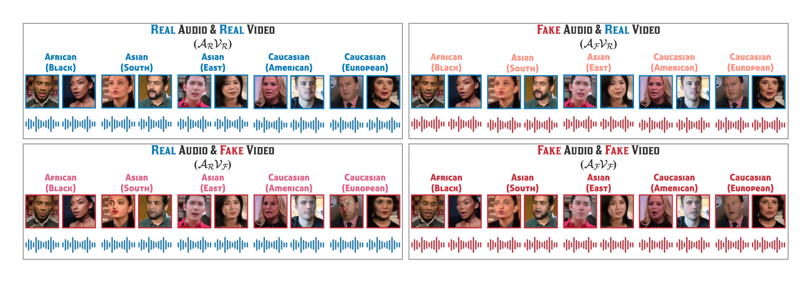
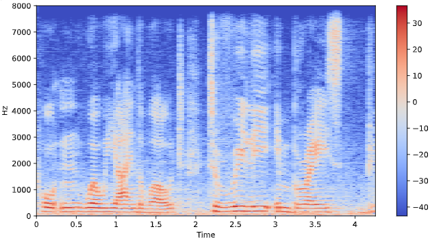

# FakeAVCeleb: A Novel Audio-Video Multimodal Deepfake Dataset



## Overview
**FakeAVCeleb** is a novel Audio-Video Multimodal Deepfake Detection dataset (**FakeAVCeleb**), which contains not only deepfake videos but also respective synthesized cloned audios. 


## Access
If you would like to download the FakeAVCeleb dataset, please fill out the [google request form](https://docs.google.com/forms/u/1/d/e/1FAIpQLSfPDd3oV0auqmmWEgCSaTEQ6CGpFeB-ozQJ35x-B_0Xjd93bw/viewform) and, once accepted, we will send you the link to our download script.sh

Once, you obtain the download link, please see the [download section](dataset/README.md) in our [Dataset site](https://~~~~~~~~~~~~~~~~~). You can also find details about our FakeAVCeleb dataset.

## Requirements and Installation
- ### Requirements

```console
python==3.8.0
numpy==1.20.3
torch==1.8.0
torchvision==0.9.0
matplotlib==3.3.4
tqdm==4.61.2
sklearn
scikit-learn
pandas
```
## Deepfake Dataset for Quantitative Comparison
- ### Quantitative comparison of FakeAVCeleb to existing publicly available **Deepfake dataset**.

| Dataset | Real Videos | Fake Videos | Total Videos | Rights Cleared | Agreeing subjects | Total subjects | Methods | Real Audio | Deepfake Audio |
|------------------|-------------------------------------------------------------|---------------------|---------------------|-----|-----|------|---|-----|-----|
| UADFV            | 49                                                          | 49                  | 98                  | No  | 0   | 49   | 1 | No  | No  |
| DeepfakeTIMIT    | 640                                                         | 320                 | 960                 | No  | 0   | 32   | 2 | No  | Yes |
| FF++             | 1000                                                        | 4,000               | 5,000               | No  | 0   | N/A  | 4 | No  | No  |
| Celeb-DF         | 590                                                         | 5,639               | 6,229               | No  | 0   | 59   | 1 | No  | No  |
| Google DFD       | 0                                                           | 3,000               | 3,000               | Yes | 28  | 28   | 5 | No  | No  |
| DeeperForensics  | 50,000                                                      | 10,000              | 60,000              | No  | 100 | 100  | 1 | No  | No  |
| DFDC             | 23,654                                                      | 104,500             | 128,154             | Yes | 960 | 960  | 8 | Yes | Yes |
| KoDF             | 62,166                                                      | 175,776             | 237,942             | Yes | 403 | 403  | 6 | No  | Yes |
| **FakeAVCeleb**      | 490 | 25,000 | 25,500 | Yes | 0 | 600 | 5 | Yes | Yes |


## Training & Evaluation
### - Full Usages

```console
  -m                   model name = [MESO4, MESOINCEPTION4, XCEPTION, EADPOSE, EXPLOTING, CAPSULE]
  -v                   path of video data
  -vm                  path of video model (For evluation)
  -a                   path of audio data
  -am                  path of audio model (For evluation)
  -sm                  path to save best-model while trai
  -l                   learning late (For training)
  -me                  number of epoch (For training)
  -nb                  batch size
  -ng                  gpu device to use (default=0) can be 0,1,2 for multi-gpu
  -vr                  validation ratio on trainset
  -ne                  patient number of early stopping
```


####
- **Note that** it must be required to write the **model name** and **either video informs**(_data path, model path_) **or audio informs**(_data path, model path_)
- More, **the model name should be picked one of thes**e : [MESO4, MESOINCEPTION4, XCEPTION, EADPOSE, EXPLOTING, CAPSULE]
### - Benchmark
To train and evaluate the model(s) in the paper, run this command:
- **1. Unimodal**
    ```TRAIN
   python triain_main.py -m=<model name> -v=<data path for video> -a=<data path for audio> 
    ```
   After train the model, you can evaluate the result.
    ```SOELY EVALUATION (audio and video, respectively.)
    python eval_main.py -m=<model name> -v=<data path for video> -vm=<model path for video> -a=<data path for audio> -am=<model path for audio>
    ```
    
    ```ENSEMBLE EVALUATION (paired video with audio.)
    python ~~
    ```
  
- **2. Multimodal**
  ```TRAIN
    python triain_main.py -m=<model name> -v=<data path for video> -vm=<model path for video> -a=<data path for audio> -am=<model path for audio> #Need to change
  ```
  ```EVALUATION
    python eval_main.py -m=<model name> -v=<data path for video> -vm=<model path for video> -a=<data path for audio> -am=<model path for audio> #Need to change
  ```

## Result
- **Frame-level AUC scores (%)** of various methods on compared datasets.

| Dataset | UADFV | DF-TIMIT (LQ) | DF-TIMIT (HQ) | FF-DF | DFD | DFDC | Celeb-DF | FakeAVCeleb |
|---|---|---|---|---|---|---|---|---|
| Capsule | 61.3 | 78.4 | 74.4 | 96.6 | 64.0 | 53.3 | 57.5 | 73.1 |
| HeadPose | 89.0 | 55.1 | 53.2 | 47.3 | 56.1 | 55.9 | 54.6 | 49.2 |
| VA-MLP | 70.2 | 61.4 | 62.1 | 66.4 | 69.1 | 61.9 | 55.0 | 55.8 |
| VA-LogReg | 54.0 | 77.0 | 77.3 | 78.0 | 77.2 | 66.2 | 55.1 | 65.4 |
| Xception-raw | 80.4 | 56.7 | 54.0 | 99.7 | 53.9 | 49.9 | 48.2 | 73.1 |
| Xception-comp | 91.2 | 95.9 | 94.4 | 99.7 | 85.9 | 72.2 | 65.3 | 73.4 |
| Meso4 | 84.3 | 87.8 | 68.4 | 84.7 | 76.0 | 75.3 | 54.8 | 43.1 |
| MesoInception4 | 82.1 | 80.4 | 62.7 | 83.0 | 75.9 | 73.2 | 53.6 | 77.8 |

- **Spectrogram** of Real audio and Fake audio from left to right.

<div style="text-align:center">
 
</div>

## Citation
If you use the FakeAVCeleb data or code please cite:
```
TBD

```
 
## Contect
If you have any questions, please contact us at hasam.khalid/shahroz/kimminha@g.skku.edu.
 
## References
###### [1] Huy H Nguyen, Junichi Yamagishi, and Isao Echizen. Use of a capsule network to detect fake images and videos. arXiv preprint arXiv:1910.12467, 2019.
###### [2] Xin Yang, Yuezun Li, and Siwei Lyu. Exposing deep fakes using inconsistent head poses. In ICASSP 2019-2019 IEEE International Conference on Acoustics, Speech and Signal Processing (ICASSP), pages 8261–8265. IEEE, 2019.
###### [3] Falko Matern, Christian Riess, and Marc Stamminger. Exploiting visual artifacts to expose deepfakes and face manipulations. In 2019 IEEE Winter Applications of Computer Vision Workshops (WACVW), pages 83–92. IEEE, 2019.
###### [4] Andreas Rossler, Davide Cozzolino, Luisa Verdoliva, Christian Riess, Justus Thies, andMatthias Nießner. Faceforensics++: Learning to detect manipulated facial images. In Proceedings of the IEEE/CVF International Conference on Computer Vision, pages 1–11, 2019.
###### [5] Darius Afchar, Vincent Nozick, Junichi Yamagishi, and Isao Echizen. Mesonet: a compact facial video forgery detection network. In 2018 IEEE International Workshop on Information Forensics and Security (WIFS), pages 1–7. IEEE, 2018.
###### [6] Conrad Sanderson and Brian C Lovell. Multi-region probabilistic histograms for robust and scalable identity inference. In International conference on biometrics, pages 199–208. Springer, 2009.
###### [7] Yuezun Li, Xin Yang, Pu Sun, Honggang Qi, and Siwei Lyu. Celeb-df: A large-scale challenging dataset for deepfake forensics. In Proceedings of the IEEE/CVF Conference on Computer Vision and Pattern Recognition, pages 3207–3216, 2020.
###### [8] Liming Jiang, Ren Li, Wayne Wu, Chen Qian, and Chen Change Loy. Deeperforensics-1.0: A large-scale dataset for real-world face forgery detection. In Proceedings of the IEEE/CVF Conference on Computer Vision and Pattern Recognition, pages 2889–2898, 2020.
###### [9] Brian Dolhansky, Joanna Bitton, Ben Pflaum, Jikuo Lu, Russ Howes, Menglin Wang, and Cristian Canton Ferrer. The deepfake detection challenge dataset. arXiv preprint arXiv:2006.07397, 2020.
###### [10] Patrick Kwon, Jaeseong You, Gyuhyeon Nam, Sungwoo Park, and Gyeongsu Chae. Kodf: A large-scale korean deepfake detection dataset. arXiv preprint arXiv:2103.10094, 2021.

## License
The data can be released under the [FakeAVCeleb Request Forms](https://docs.google.com/forms/u/1/d/e/1FAIpQLSfPDd3oV0auqmmWEgCSaTEQ6CGpFeB-ozQJ35x-B_0Xjd93bw/viewform), and the code is released under the MIT license.

Copyright (c) 2021
